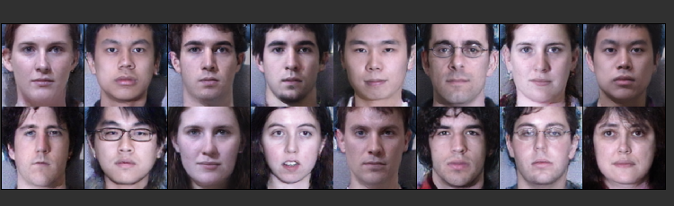
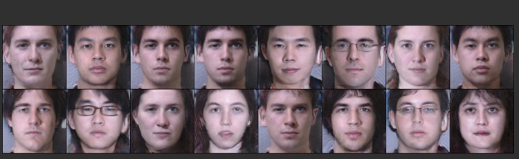

# FaceFrontalization

## Introduction

This repository contains code for face frontalization using Generative Adversarial Networks (GANs). GANs are used to generate realistic frontal-facing images from non-frontal face images. The models implemented here aim to achieve this transformation effectively.

## Folder Structure

```
├── boarder.py
├── config.py
├── dataset.py
├── models
│   ├── SegNet.py
│   ├── __init__.py
│   ├── discriminator.py
│   └── unet.py
├── train.py
├── utils.py
└── weigths
└── logs
```

- **boarder.py**: Contains code for visualization using TensorBoard.
- **config.py**: Configuration file where model and training parameters can be adjusted.
- **dataset.py**: Handles data loading and preprocessing.
- **models**: Directory containing model architectures.
    - **SegNet.py**: SegNet model architecture.
    - **discriminator.py**: Discriminator model architecture.
    - **unet.py**: U-Net model architecture.
- **train.py**: Script for training the models.
- **utils.py**: Utility functions used in the project.
- **weights**: Directory to save trained model weights (tracked using Git LFS).
- **logs**: Directory to store TensorBoard logs.

## Usage

1. **Configuration**: Adjust the parameters in `config.py` according to your requirements.
2. **Training**: Execute `train.py` to train the GAN models. You can run the training using the following command:

    ```bash
    python train.py
    ```
3. **TensorBoard Visualization**: You can visualize the training progress using TensorBoard by running the following command:

    ```bash
    tensorboard --logdir=logs
    ```

    Here are examples of the visualizations obtained from TensorBoard:

    - Real Faces:
    

    - Generated Faces:
    


4. **Downloading Pre-trained Weights and Logs**: Due to GitHub's file size limitations, the `weights` and `logs` directories are not included in this repository. However, you can download them from the following Google Drive link:

    [Download Weights and Logs](https://drive.google.com/drive/folders/1VrigQSP8iPeeNuCgQjDywuWxeTskW3xW?usp=share_link)

## Training Details

- The GAN models are trained for a certain number of iterations specified in `config.py`.
- Model configuration and training parameters can be modified in `config.py`.
- The training script `train.py` orchestrates the training process.

## Requirements

- Python 3.x
- Other dependencies as specified in the `requirements.txt` file.
